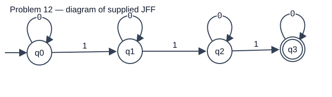

# Problem 12

Language: Exactly three 1 symbols (inferred; notebook confirmation pending). Alphabet: `{0,1}`.

**Provisional:** this definition was inferred from the automaton. Confirm against the notebook before submission.

## NFA diagram

Generated from the supplied JFF transition relation; double circles denote accepting states.

## Test cases

Load `NFA-12t.txt` using Input → Multiple Run → Load Inputs. It contains only input strings, one per line, with accepted inputs first. Blank lines are whitespace and do not load the empty string; test ε separately using Enter Lambda.

| Input | Expected |
|---|---|
| `111` | Accept |
| `0111` | Accept |
| `1110` | Accept |
| `10101` | Accept |
| `0101010` | Accept |
| `000111000` | Accept |
| `1001001` | Accept |
| `0` | Reject |
| `1` | Reject |
| `11` | Reject |
| `1111` | Reject |
| `000` | Reject |
| `1010` | Reject |
| `11110` | Reject |
| `011110` | Reject |
| `0001111000` | Reject |
| ε (enter manually) | Reject |

The suite includes short inputs, boundary counts, varied symbol orders, and longer repetitions. Nonbinary input `2` should reject and can be entered manually.

## Verification status

The included independent simulator checks every binary string through length 12 against the predicate above. This is bounded evidence, and inferred predicates still require notebook confirmation. JFLAP runtime results are in `verification.txt`. **GUI Multiple Run screenshot remains to be captured**; runtime verification does not fulfill that screenshot requirement.

