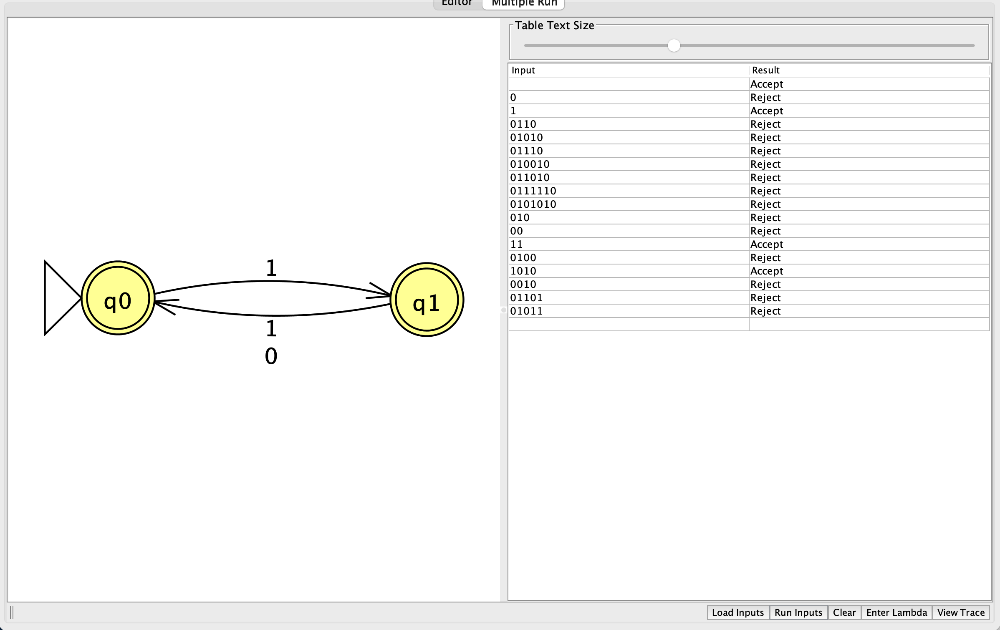

# Problem 16

Language: Every odd-numbered position is 1, positions start at 1. Alphabet: `{0,1}`.

The language definition was supplied and confirmed by the student.

## NFA diagram

Generated from the supplied JFF transition relation; double circles denote accepting states.

## Why the design recognizes the language

State q0 means an even number of symbols has been read and the next position is odd; only `1` may leave q0. State q1 means an odd number has been read and the next position is even; either symbol may leave q1. Both states accept, so valid strings of either length accept. The empty string accepts because it has no odd position violating the condition.

## Test cases

Load `NFA-16t.txt` using Input → Multiple Run → Load Inputs. It contains only input strings, one per line, with accepted inputs first. Blank lines are whitespace and do not load the empty string; test ε separately using Enter Lambda.

| Input | Expected |
|---|---|
| `1` | Accept |
| `10` | Accept |
| `11` | Accept |
| `101` | Accept |
| `111` | Accept |
| `1010` | Accept |
| `10101` | Accept |
| `11111` | Accept |
| `101010` | Accept |
| `0` | Reject |
| `00` | Reject |
| `01` | Reject |
| `100` | Reject |
| `110` | Reject |
| `10100` | Reject |
| `1001` | Reject |
| `0101` | Reject |
| `110101` | Reject |
| ε (enter manually) | Accept |

The suite includes short inputs, boundary counts, varied symbol orders, and longer repetitions. Nonbinary input `2` should reject and can be entered manually.

## Verification status

The included independent simulator checks every binary string through length 12 against the predicate above. All checks passed against the confirmed language definition. This is bounded test evidence; the argument above explains correctness for arbitrary input lengths. JFLAP runtime results are in `verification.txt`. A student-provided GUI Multiple Run screenshot is attached below. All 18 displayed results, including ε, match the language. The screenshot uses a shared input list and does not show the full problem-specific test file; full-suite GUI evidence remains pending.

## Computation example `110101`

This is a proposed corner case for study, not a claim that the student made a mistake. Final result: **Reject**.

| Consumed prefix | Active states |
|---|---|
| ε | {q0} |
| `1` | {q1} |
| `11` | {q0} |
| `110` | ∅ |
| `1101` | ∅ |
| `11010` | ∅ |
| `110101` | ∅ |

After `11`, the machine is in q0. The next `0` has no transition, so the active set becomes empty and stays empty. Being in an accepting state before all input is read does not imply acceptance.

**Student evidence pending:** draw this computation by hand, including all branches for #8, then capture JFLAP Step by State or Step with Closure at the initial configuration and after each symbol. Repeat for at least three problems. Add the real hand-drawn photo and screenshots here; the table above does not replace them.

JFLAP stops after attempting the third symbol (`0`), because q0 has no transition on `0`. The remaining suffix `101` cannot be consumed. The later empty sets in the table describe the abstract extended transition function; they are not additional executable JFLAP steps.

## Review of supplied batch screenshot

The screenshot shows the NFA and these actual results:

| Input | JFLAP result |
|---|---|
| ε | Accept |
| `0` | Reject |
| `1` | Accept |
| `0110` | Reject |
| `01010` | Reject |
| `01110` | Reject |
| `010010` | Reject |
| `011010` | Reject |
| `0111110` | Reject |
| `0101010` | Reject |
| `010` | Reject |
| `00` | Reject |
| `11` | Accept |
| `0100` | Reject |
| `1010` | Accept |
| `0010` | Reject |
| `01101` | Reject |
| `01011` | Reject |

Every displayed result is correct. Test-file inputs not shown: `10`, `101`, `111`, `10101`, `11111`, `101010`, `01`, `100`, `110`, `10100`, `1001`, `0101`, `110101`. Reload this problem’s own test file and capture the complete results to document those cases. The supplied screenshot mixes accepting and rejecting rows; the saved `.txt` file already orders accepting inputs first.

## JFLAP and hand-drawn evidence

See [EVIDENCE.md](EVIDENCE.md) for capture instructions and filenames.

<!-- evidence:start -->

Pending: `NFA-16-tree.png`.

Pending: `NFA-16-step-00.png`.

Pending: `NFA-16-step-01.png`.

Pending: `NFA-16-step-02.png`.

Pending: `NFA-16-step-03.png`.

<!-- evidence:end -->
