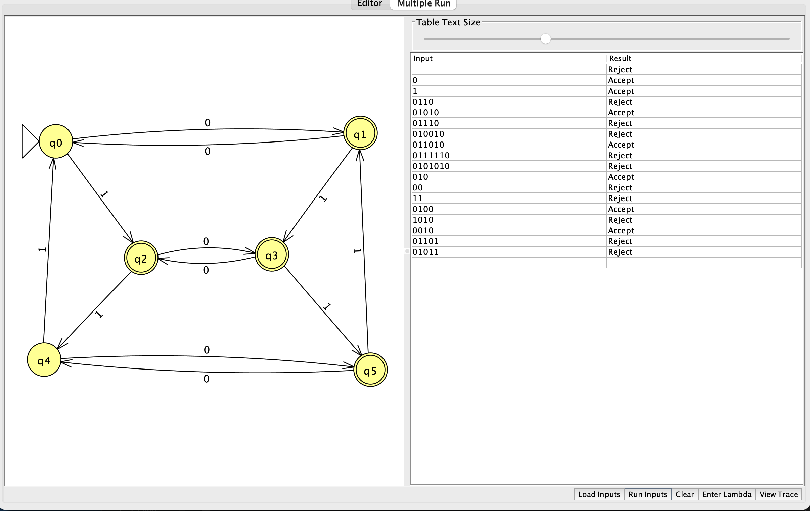

# Problem 20

Language: Odd number of 0 symbols OR number of 1 symbols congruent to 1 modulo 3. Alphabet: `{0,1}`.

The language definition was supplied and confirmed by the student.

## NFA diagram

Generated from the supplied JFF transition relation; double circles denote accepting states.

## Why the design recognizes the language

Track the pair (number of 0 symbols modulo 2, number of 1 symbols modulo 3): q0=(0,0), q1=(1,0), q2=(0,1), q3=(1,1), q4=(0,2), q5=(1,2). Every `0` toggles the first coordinate and every `1` increments the second modulo 3. Accepting states q1, q2, q3, and q5 are exactly the pairs where the first coordinate is 1 OR the second coordinate is 1. For a nonnegative count, remainder 1 is equivalent to a count of 3k+1 with k≥0.

## Test cases

Load `NFA-20t.txt` using Input → Multiple Run → Load Inputs. It contains only input strings, one per line, with accepted inputs first. Blank lines are whitespace and do not load the empty string; test ε separately using Enter Lambda.

| Input | Expected |
|---|---|
| `0` | Accept |
| `1` | Accept |
| `01` | Accept |
| `10` | Accept |
| `1111` | Accept |
| `001` | Accept |
| `000` | Accept |
| `1111111` | Accept |
| `01010101` | Accept |
| `11` | Reject |
| `111` | Reject |
| `00` | Reject |
| `0011` | Reject |
| `00111` | Reject |
| `0101` | Reject |
| `1010` | Reject |
| `000000` | Reject |
| `111111` | Reject |
| ε (enter manually) | Reject |

The suite includes short inputs, boundary counts, varied symbol orders, and longer repetitions. Nonbinary input `2` should reject and can be entered manually.

## Verification status

The included independent simulator checks every binary string through length 12 against the predicate above. All checks passed against the confirmed language definition. This is bounded test evidence; the argument above explains correctness for arbitrary input lengths. JFLAP runtime results are in `verification.txt`. A student-provided GUI Multiple Run screenshot is attached below. All 18 displayed results, including ε, match the language. The screenshot uses a shared input list and does not show the full problem-specific test file; full-suite GUI evidence remains pending.

## Computation example `1111`

This is a proposed corner case for study, not a claim that the student made a mistake. Final result: **Accept**.

| Consumed prefix | Active states |
|---|---|
| ε | {q0} |
| `1` | {q2} |
| `11` | {q4} |
| `111` | {q0} |
| `1111` | {q2} |

Four 1 symbols end in q2 and accept even though there are zero 0 symbols. An OR condition accepts when either condition is satisfied.

**Student evidence pending:** draw this computation by hand, including all branches for #8, then capture JFLAP Step by State or Step with Closure at the initial configuration and after each symbol. Repeat for at least three problems. Add the real hand-drawn photo and screenshots here; the table above does not replace them.

## Review of supplied batch screenshot

The screenshot shows the NFA and these actual results:

| Input | JFLAP result |
|---|---|
| ε | Reject |
| `0` | Accept |
| `1` | Accept |
| `0110` | Reject |
| `01010` | Accept |
| `01110` | Reject |
| `010010` | Reject |
| `011010` | Accept |
| `0111110` | Reject |
| `0101010` | Reject |
| `010` | Accept |
| `00` | Reject |
| `11` | Reject |
| `0100` | Accept |
| `1010` | Reject |
| `0010` | Accept |
| `01101` | Reject |
| `01011` | Reject |

Every displayed result is correct. Test-file inputs not shown: `01`, `10`, `1111`, `001`, `000`, `1111111`, `01010101`, `111`, `0011`, `00111`, `0101`, `000000`, `111111`. Reload this problem’s own test file and capture the complete results to document those cases. The supplied screenshot mixes accepting and rejecting rows; the saved `.txt` file already orders accepting inputs first.

## JFLAP and hand-drawn evidence

See [EVIDENCE.md](EVIDENCE.md) for capture instructions and filenames.

<!-- evidence:start -->

Pending: `NFA-20-tree.png`.

Pending: `NFA-20-step-00.png`.

Pending: `NFA-20-step-01.png`.

Pending: `NFA-20-step-02.png`.

Pending: `NFA-20-step-03.png`.

Pending: `NFA-20-step-04.png`.

<!-- evidence:end -->
