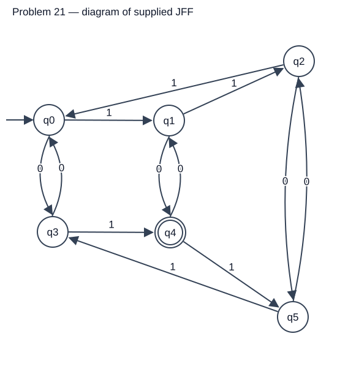

# Problem 21

Language: Odd number of 0 symbols AND number of 1 symbols congruent to 1 modulo 3 (inferred). Alphabet: `{0,1}`.

**Provisional:** this definition was inferred from the automaton. Confirm against the notebook before submission.

## NFA diagram

Generated from the supplied JFF transition relation; double circles denote accepting states.

## Test cases

Load `NFA-21t.txt` using Input → Multiple Run → Load Inputs. It contains only input strings, one per line, with accepted inputs first. Blank lines are whitespace and do not load the empty string; test ε separately using Enter Lambda.

| Input | Expected |
|---|---|
| `01` | Accept |
| `10` | Accept |
| `01111` | Accept |
| `11110` | Accept |
| `0001` | Accept |
| `1000` | Accept |
| `1010101` | Accept |
| `0001111` | Accept |
| `01111111` | Accept |
| `0` | Reject |
| `1` | Reject |
| `00` | Reject |
| `11` | Reject |
| `111` | Reject |
| `1111` | Reject |
| `001` | Reject |
| `011` | Reject |
| `0111` | Reject |
| `001111` | Reject |
| ε (enter manually) | Reject |

The suite includes short inputs, boundary counts, varied symbol orders, and longer repetitions. Nonbinary input `2` should reject and can be entered manually.

## Verification status

The included independent simulator checks every binary string through length 12 against the predicate above. This is bounded evidence, and inferred predicates still require notebook confirmation. JFLAP runtime results are in `verification.txt`. **GUI Multiple Run screenshot remains to be captured**; runtime verification does not fulfill that screenshot requirement.

## Computation example `01111`

This is a proposed corner case for study, not a claim that the student made a mistake. Final result: **Accept**.

| Consumed prefix | Active states |
|---|---|
| ε | {q0} |
| `0` | {q3} |
| `01` | {q4} |
| `011` | {q5} |
| `0111` | {q3} |
| `01111` | {q4} |

One 0 and four 1 symbols satisfy both conditions. The machine accepts only when both the parity and remainder are correct.

**Student evidence pending:** draw this computation by hand, including all branches for #8, then capture JFLAP Step by State or Step with Closure at the initial configuration and after each symbol. Repeat for at least three problems. Add the real hand-drawn photo and screenshots here; the table above does not replace them.
