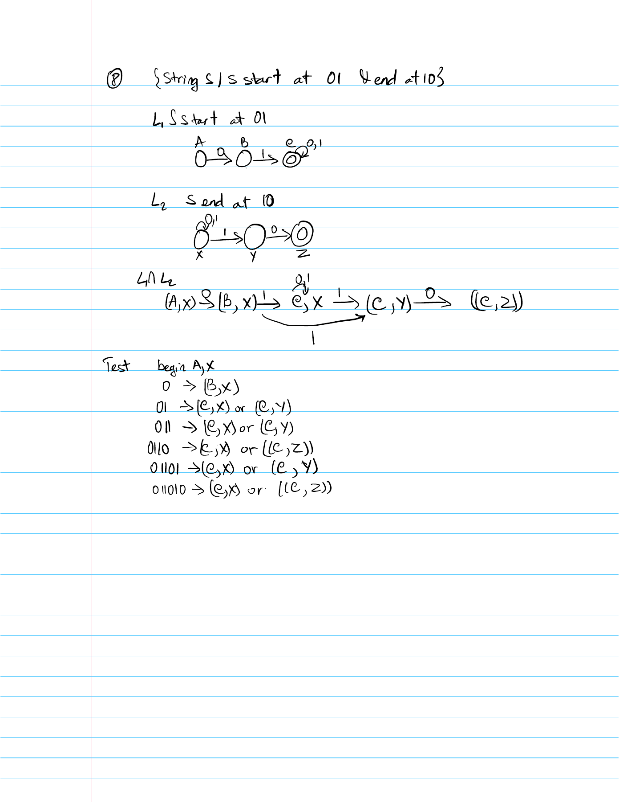
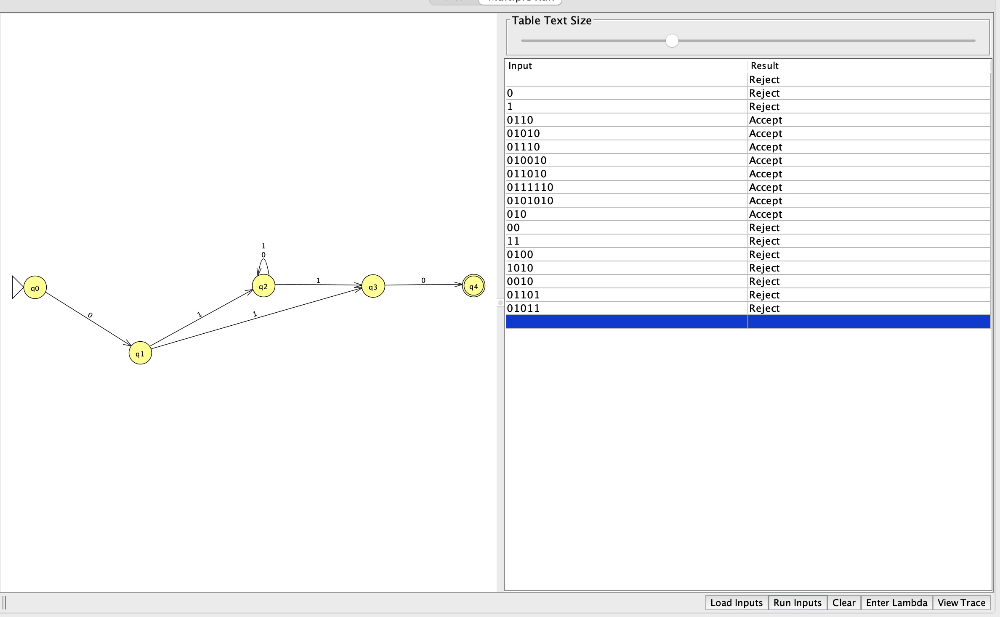

# Problem 8

Language: Starts with 01 and ends with 10. Alphabet: `{0,1}`.

The language definition was supplied and confirmed by the student; it also matches the local course document.

## NFA diagram

Generated from the supplied JFF transition relation; double circles denote accepting states.

## Why the design recognizes the language

The initial path consumes `01`. The branch from q1 to q3 permits the overlapping shortest input `010`. The branch through q2 consumes any middle symbols, then guesses the final `10` by moving to q3 on `1` and q4 on `0`. Because q4 has no outgoing transitions, an accepting path must consume the whole input and end with `10`. Conversely, every string starting with `01` and ending with `10` has one of these accepting paths.

## Test cases

Load `n08t.txt` using Input → Multiple Run → Load Inputs. It contains only input strings, one per line, with accepted inputs first. Blank lines are whitespace and do not load the empty string; test ε separately using Enter Lambda.

| Input | Expected |
|---|---|
| `010` | Accept |
| `0110` | Accept |
| `01010` | Accept |
| `01110` | Accept |
| `010010` | Accept |
| `011010` | Accept |
| `0111110` | Accept |
| `0101010` | Accept |
| `0` | Reject |
| `1` | Reject |
| `01` | Reject |
| `10` | Reject |
| `00` | Reject |
| `11` | Reject |
| `0100` | Reject |
| `1010` | Reject |
| `0010` | Reject |
| `01101` | Reject |
| `01011` | Reject |
| ε (enter manually) | Reject |

The suite includes short inputs, boundary counts, varied symbol orders, and longer repetitions. Nonbinary input `2` should reject and can be entered manually.

## Verification status

The included independent simulator checks every binary string through length 12 against the predicate above. All checks passed against the confirmed language definition. This is bounded test evidence; the argument above explains correctness for arbitrary input lengths. JFLAP runtime results are in `verification.txt`. The attached GUI Multiple Run screenshot shows all 19 inputs from `n08t.txt`, in order with accepted inputs first. Every displayed result matches the expected table. The earlier screenshot also documents ε: **Reject**.

## Computation example `011010`

This is a proposed corner case for study, not a claim that the student made a mistake. Final result: **Accept**.

| Consumed prefix | Active states |
|---|---|
| ε | {q0} |
| `0` | {q1} |
| `01` | {q2, q3} |
| `011` | {q2, q3} |
| `0110` | {q2, q4} |
| `01101` | {q2, q3} |
| `011010` | {q2, q4} |

After `011`, retain both q2 and q3. A branch that guesses an ending too early can die while the loop branch continues. After `0110`, q2 and accepting q4 coexist; q4 has no outgoing edge, so the remaining input must be processed by the q2 branch.

**Student evidence pending:** draw this computation by hand, including all branches for #8, then capture JFLAP Step by State or Step with Closure at the initial configuration and after each symbol. Repeat for at least three problems. Add the real hand-drawn photo and screenshots here; the table above does not replace them.

## Review of supplied batch screenshot

All 19 test-file inputs are visible, their results are correct, and accepting inputs appear before rejecting inputs. The separate earlier-run image below records the empty-string result.

## Handwritten design notes

[Original handwritten PDF](Homework-NFA.pdf), page 1. These are design diagrams and notes; string-specific computation-tree evidence remains pending.

## Handwritten test traces and review

[Original handwritten test PDF](handwritetest.pdf), page 1.

The handwritten trace for `011010` is correct. Its names correspond to q0=(A,x), q1=(B,x), q2=(C,x), q3=(C,y), and q4=(C,z). After `01`, both q2 and q3 are possible. The final set contains q2 and accepting q4. The page records sets of active states; a full branch-by-branch computation tree and matching JFLAP step screenshots still need to be supplied if required.

## JFLAP and hand-drawn evidence

See [EVIDENCE.md](EVIDENCE.md) for capture instructions and filenames.

<!-- evidence:start -->

Pending: `n08-tree.png`.

Pending: `n08-step-00.png`.

Pending: `n08-step-01.png`.

Pending: `n08-step-02.png`.

Pending: `n08-step-03.png`.

Pending: `n08-step-04.png`.

Pending: `n08-step-05.png`.

Pending: `n08-step-06.png`.

<!-- evidence:end -->
