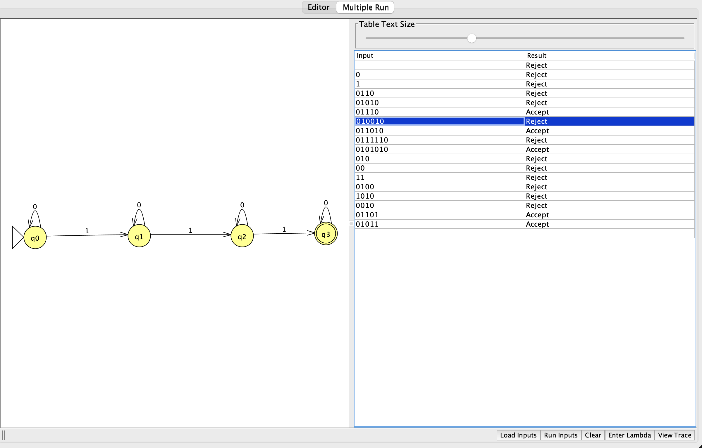

# Problem 12

Language: Exactly three 1 symbols. Alphabet: `{0,1}`.

The language definition was supplied and confirmed by the student.

## NFA diagram

Generated from the supplied JFF transition relation; double circles denote accepting states.

## Why the design recognizes the language

State q0 means zero 1 symbols have been read, q1 means one, q2 means two, and q3 means three. Each `0` preserves the count; each `1` advances it. Only q3 accepts, and it has no `1` transition, so a fourth 1 kills the computation. Therefore acceptance is equivalent to exactly three 1 symbols.

## Test cases

Load `n12t.txt` using Input → Multiple Run → Load Inputs. It contains only input strings, one per line, with accepted inputs first. Blank lines are whitespace and do not load the empty string; test ε separately using Enter Lambda.

| Input | Expected |
|---|---|
| `111` | Accept |
| `0111` | Accept |
| `1110` | Accept |
| `10101` | Accept |
| `0101010` | Accept |
| `000111000` | Accept |
| `1001001` | Accept |
| `0` | Reject |
| `1` | Reject |
| `11` | Reject |
| `1111` | Reject |
| `000` | Reject |
| `1010` | Reject |
| `11110` | Reject |
| `011110` | Reject |
| `0001111000` | Reject |
| ε (enter manually) | Reject |

The suite includes short inputs, boundary counts, varied symbol orders, and longer repetitions. Nonbinary input `2` should reject and can be entered manually.

## Verification status

The included independent simulator checks every binary string through length 12 against the predicate above. All checks passed against the confirmed language definition. This is bounded test evidence; the argument above explains correctness for arbitrary input lengths. JFLAP runtime results are in `verification.txt`. A student-provided GUI Multiple Run screenshot is attached below. All 18 displayed results, including ε, match the language. The screenshot uses a shared input list and does not show the full problem-specific test file; full-suite GUI evidence remains pending.

## Review of supplied batch screenshot

The screenshot shows the NFA and these actual results:

| Input | JFLAP result |
|---|---|
| ε | Reject |
| `0` | Reject |
| `1` | Reject |
| `0110` | Reject |
| `01010` | Reject |
| `01110` | Accept |
| `010010` | Reject |
| `011010` | Accept |
| `0111110` | Reject |
| `0101010` | Accept |
| `010` | Reject |
| `00` | Reject |
| `11` | Reject |
| `0100` | Reject |
| `1010` | Reject |
| `0010` | Reject |
| `01101` | Accept |
| `01011` | Accept |

Every displayed result is correct. Test-file inputs not shown: `111`, `0111`, `1110`, `10101`, `000111000`, `1001001`, `1111`, `000`, `11110`, `011110`, `0001111000`. Reload this problem’s own test file and capture the complete results to document those cases. The supplied screenshot mixes accepting and rejecting rows; the saved `.txt` file already orders accepting inputs first.

## JFLAP and hand-drawn evidence

See [EVIDENCE.md](EVIDENCE.md) for capture instructions and filenames.

<!-- evidence:start -->

<!-- evidence:end -->
