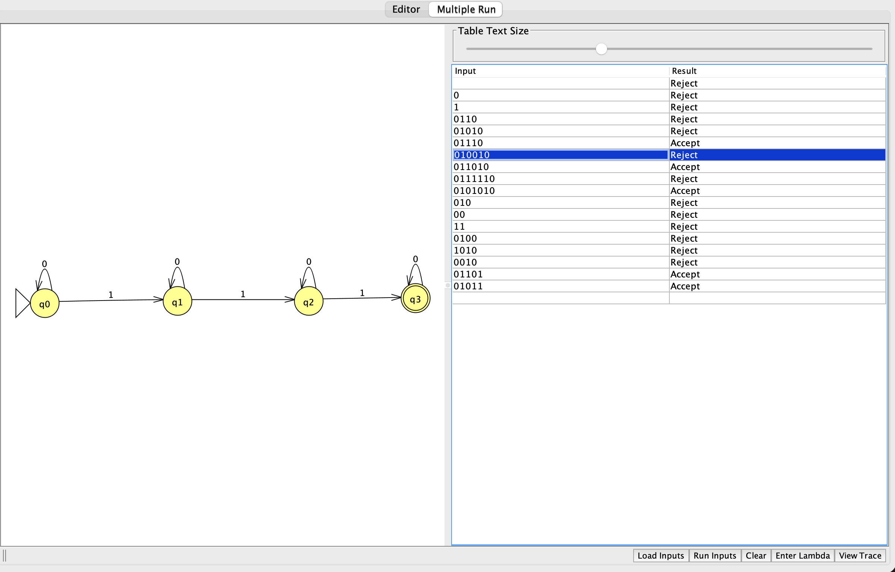

# Problem 12

Language: Exactly three 1 symbols. Alphabet: `{0,1}`.

The language definition was supplied and confirmed by the student.

## NFA diagram

Generated from the supplied JFF transition relation; double circles denote accepting states.

## Why the design recognizes the language

State q0 means zero 1 symbols have been read, q1 means one, q2 means two, and q3 means three. Each `0` preserves the count; each `1` advances it. Only q3 accepts, and it has no `1` transition, so a fourth 1 kills the computation. Therefore acceptance is equivalent to exactly three 1 symbols.

## Test cases

Load `n12t.txt` using Input → Multiple Run → Load Inputs. It contains only input strings, one per line, with accepted inputs first. Blank lines are whitespace and do not load the empty string; test ε separately using Enter Lambda.

| Input | Expected |
|---|---|
| `111` | Accept |
| `0111` | Accept |
| `1110` | Accept |
| `10101` | Accept |
| `0101010` | Accept |
| `000111000` | Accept |
| `1001001` | Accept |
| `0` | Reject |
| `1` | Reject |
| `11` | Reject |
| `1111` | Reject |
| `000` | Reject |
| `1010` | Reject |
| `11110` | Reject |
| `011110` | Reject |
| `0001111000` | Reject |
| ε (enter manually) | Reject |

The suite includes short inputs, boundary counts, varied symbol orders, and longer repetitions. Nonbinary input `2` should reject and can be entered manually.

## Verification status

The included independent simulator checks every binary string through length 12 against the predicate above. All checks passed against the confirmed language definition. This is bounded test evidence; the argument above explains correctness for arbitrary input lengths. JFLAP runtime results are in `verification.txt`. The attached GUI Multiple Run screenshot shows all 16 inputs from `n12t.txt`, in order with accepted inputs first. Every displayed result matches the expected table. The earlier screenshot also documents ε: **Reject**.

## Review of supplied batch screenshot

All 16 test-file inputs are visible, their results are correct, and accepting inputs appear before rejecting inputs. The separate earlier-run image below records the empty-string result.

## Handwritten design notes

[Original handwritten PDF](Homework-NFA.pdf), page 1. These are design diagrams and notes; string-specific computation-tree evidence remains pending.

The handwritten sketch omits the `0` self-loop on the accepting state. That loop is required to accept inputs such as `1110`. The submitted `n12.jff` already contains it and passes those tests; the original handwritten page is preserved as supplied.

## Handwritten test traces and review

[Original handwritten test PDF](handwritetest.pdf), page 2.

The initial trace through `0101010` is correct: A → A → B → B → C → C → D → D, where A=q0, B=q1, C=q2, and D=q3. The next `1` produces a fourth 1, so D has no valid transition. Therefore `01010101` rejects with an empty active-state set, rather than returning to A. All longer extensions shown in the right-hand column also reject; computation cannot restart after a branch dies. The original handwriting is preserved so the mistake and correction are visible.

## JFLAP and hand-drawn evidence

See [EVIDENCE.md](EVIDENCE.md) for capture instructions and filenames.

<!-- evidence:start -->

<!-- evidence:end -->
