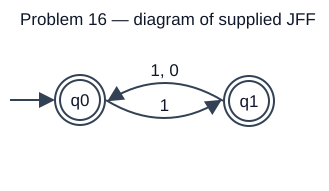
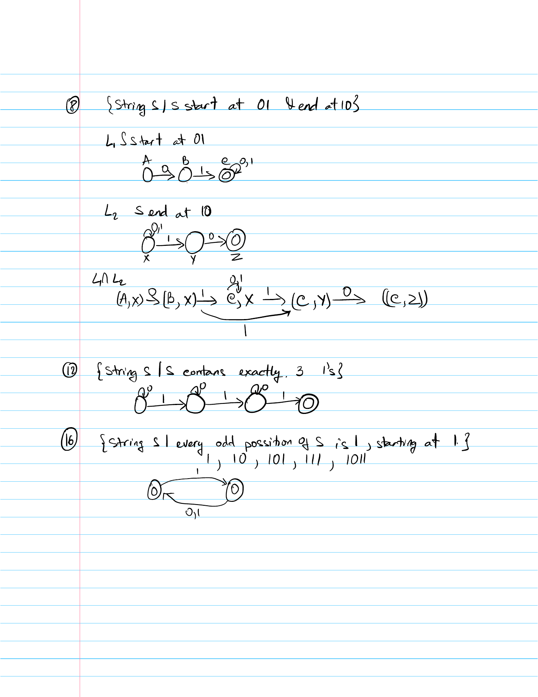
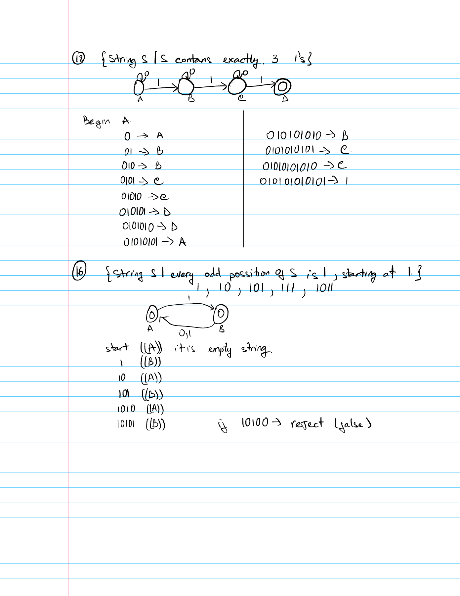
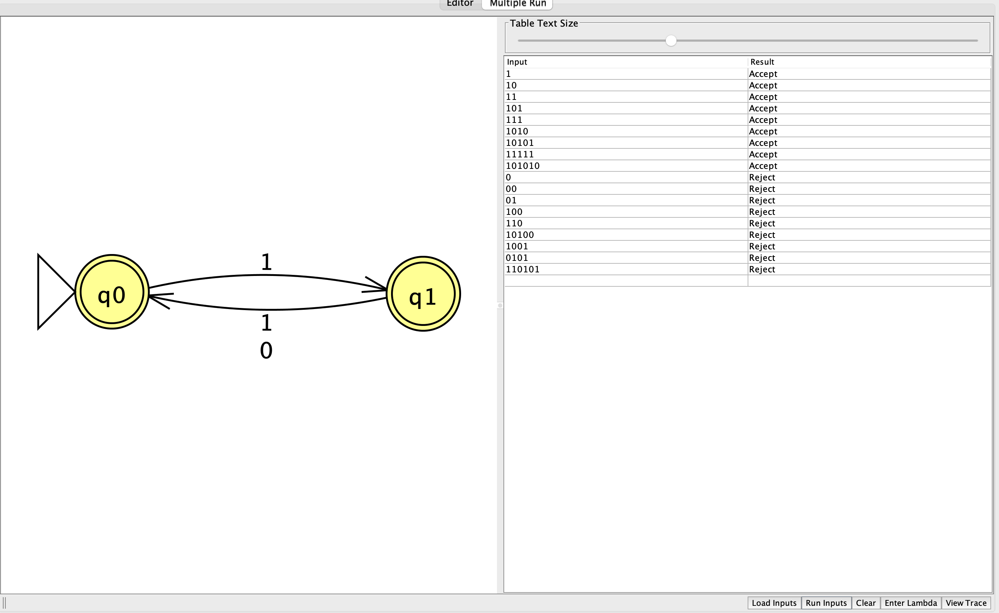
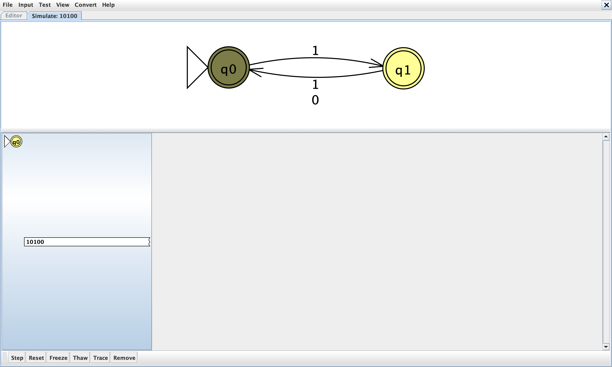
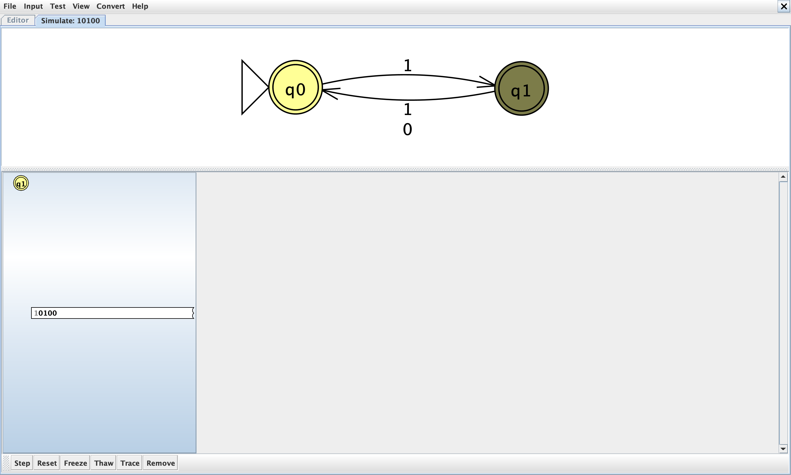
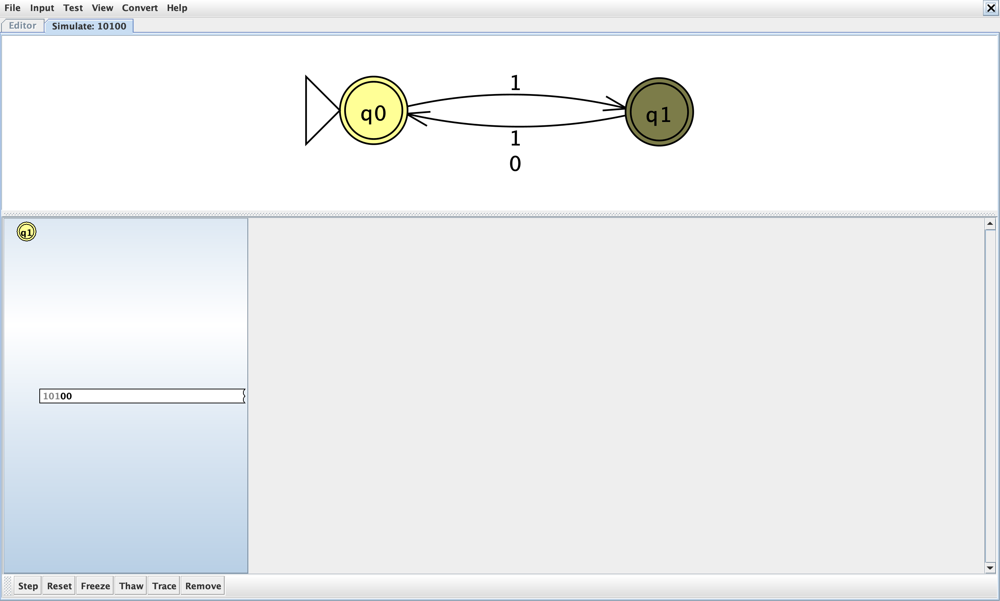
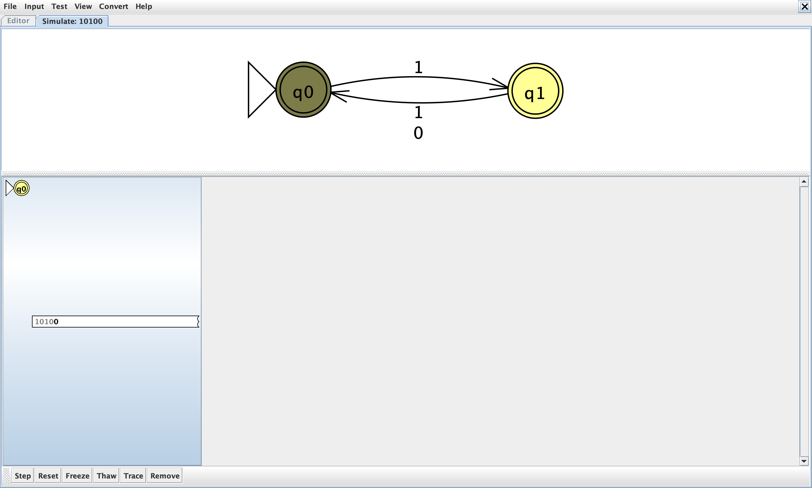
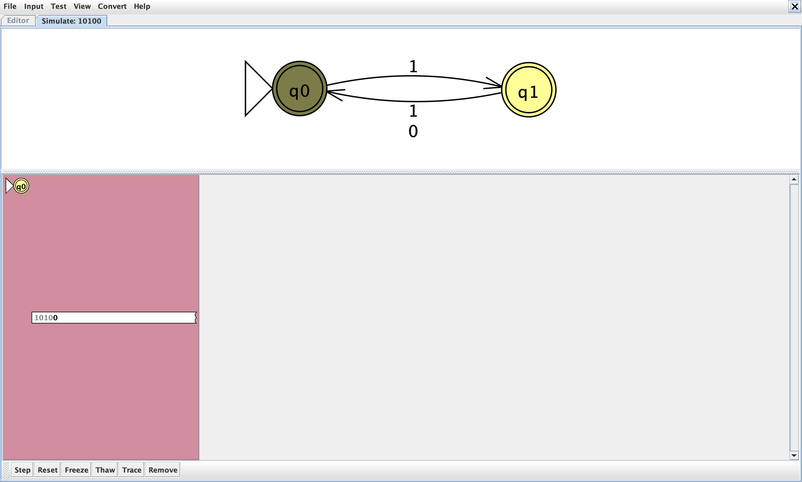

# Problem 16

Language: Every odd-numbered position is 1, positions start at 1. Alphabet: `{0,1}`.

The language definition was supplied and confirmed by the student.

## NFA diagram

Generated from the supplied JFF transition relation; double circles denote accepting states.

## Why the design recognizes the language

State q0 means an even number of symbols has been read and the next position is odd; only `1` may leave q0. State q1 means an odd number has been read and the next position is even; either symbol may leave q1. Both states accept, so valid strings of either length accept. The empty string accepts because it has no odd position violating the condition.

## Test cases

Load `n16t.txt` using Input → Multiple Run → Load Inputs. It contains only input strings, one per line, with accepted inputs first. Blank lines are whitespace and do not load the empty string; test ε separately using Enter Lambda.

| Input | Expected |
|---|---|
| `1` | Accept |
| `10` | Accept |
| `11` | Accept |
| `101` | Accept |
| `111` | Accept |
| `1010` | Accept |
| `10101` | Accept |
| `11111` | Accept |
| `101010` | Accept |
| `0` | Reject |
| `00` | Reject |
| `01` | Reject |
| `100` | Reject |
| `110` | Reject |
| `10100` | Reject |
| `1001` | Reject |
| `0101` | Reject |
| `110101` | Reject |
| ε (enter manually) | Accept |

The suite includes short inputs, boundary counts, varied symbol orders, and longer repetitions. Nonbinary input `2` should reject and can be entered manually.

## Verification status

The included independent simulator checks every binary string through length 12 against the predicate above. All checks passed against the confirmed language definition. This is bounded test evidence; the argument above explains correctness for arbitrary input lengths. JFLAP runtime results are in `verification.txt`. The attached GUI Multiple Run screenshot shows all 18 inputs from `n16t.txt`, in order with accepted inputs first. Every displayed result matches the expected table. The earlier screenshot also documents ε: **Accept**.

## Computation example `110101`

This is a proposed corner case for study, not a claim that the student made a mistake. Final result: **Reject**.

| Consumed prefix | Active states |
|---|---|
| ε | {q0} |
| `1` | {q1} |
| `11` | {q0} |
| `110` | ∅ |
| `1101` | ∅ |
| `11010` | ∅ |
| `110101` | ∅ |

After `11`, the machine is in q0. The next `0` has no transition, so the active set becomes empty and stays empty. Being in an accepting state before all input is read does not imply acceptance.

Handwritten traces and matching step screenshots for #8, #12, and #16 are attached in their reports. This example can be used for additional study.

JFLAP stops after attempting the third symbol (`0`), because q0 has no transition on `0`. The remaining suffix `101` cannot be consumed. The later empty sets in the table describe the abstract extended transition function; they are not additional executable JFLAP steps.

## Review of supplied batch screenshot

All 18 test-file inputs are visible, their results are correct, and accepting inputs appear before rejecting inputs. The separate earlier-run image below records the empty-string result.

## Handwritten design notes

[Original handwritten PDF](Homework-NFA.pdf), page 1. These are design diagrams and notes. The separate handwritten test PDF records the input traces for #8, #12, and #16, with matching GUI captures in those reports.

## Handwritten test traces and review

[Original handwritten test PDF](handwritetest.pdf), page 2.

The handwritten trace is correct: the empty string starts in accepting A=q0; `1` ends in B=q1, `10` in A, `101` in B, `1010` in A, and `10101` in B. For `10100`, the fifth symbol is `0` in an odd position. There is no transition from A on `0`, so the active-state set becomes empty and the input rejects.

## Captured JFLAP computation `10100`

Final result: **Reject**. The images below show the initial configuration and each click of JFLAP’s Step button, captured from the real JFLAP 7.1 simulation pane using the authorized Java helper.

| Step | Consumed prefix | Live states |
|---|---|---|
| 00 | ε | {q0} |
| 01 | `1` | {q1} |
| 02 | `10` | {q0} |
| 03 | `101` | {q1} |
| 04 | `1010` | {q0} |
| 05 | `10100` | ∅ |

JFLAP may retain a rejected configuration in red. It is no longer a live branch; when no transition exists, its final symbol remains unread. Green marks acceptance after the full input is consumed.

## JFLAP and hand-drawn evidence

See [EVIDENCE.md](EVIDENCE.md) for capture instructions and filenames.

<!-- evidence:start -->

<!-- evidence:end -->
