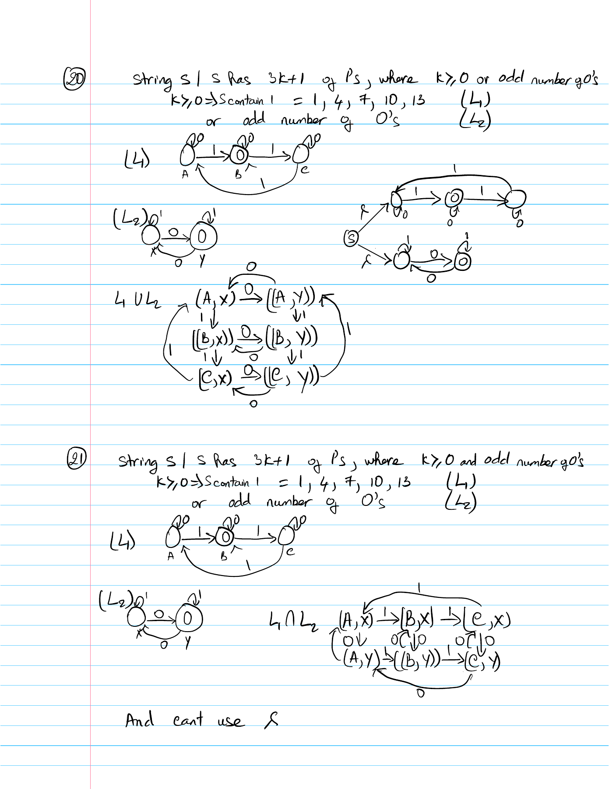
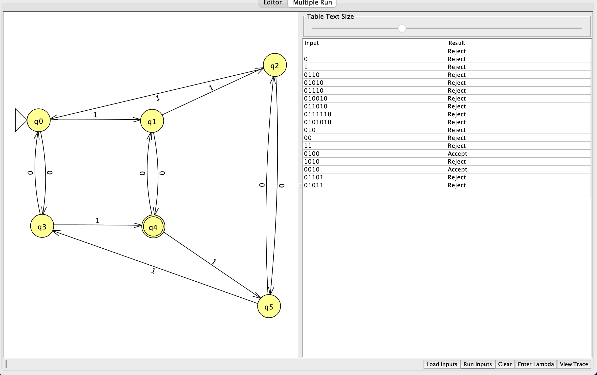

# Problem 21

Language: Odd number of 0 symbols AND number of 1 symbols congruent to 1 modulo 3. Alphabet: `{0,1}`.

The language definition was supplied and confirmed by the student.

## NFA diagram

Generated from the supplied JFF transition relation; double circles denote accepting states.

## Why the design recognizes the language

Track the pair (number of 0 symbols modulo 2, number of 1 symbols modulo 3): q0=(0,0), q1=(0,1), q2=(0,2), q3=(1,0), q4=(1,1), q5=(1,2). Every `0` toggles the first coordinate and every `1` increments the second modulo 3. Only q4 accepts, so both odd 0 count AND 1 count of 3k+1 with k≥0 must hold.

## Test cases

Load `n21t.txt` using Input → Multiple Run → Load Inputs. It contains only input strings, one per line, with accepted inputs first. Blank lines are whitespace and do not load the empty string; test ε separately using Enter Lambda.

| Input | Expected |
|---|---|
| `01` | Accept |
| `10` | Accept |
| `01111` | Accept |
| `11110` | Accept |
| `0001` | Accept |
| `1000` | Accept |
| `1010101` | Accept |
| `0001111` | Accept |
| `01111111` | Accept |
| `0` | Reject |
| `1` | Reject |
| `00` | Reject |
| `11` | Reject |
| `111` | Reject |
| `1111` | Reject |
| `001` | Reject |
| `011` | Reject |
| `0111` | Reject |
| `001111` | Reject |
| ε (enter manually) | Reject |

The suite includes short inputs, boundary counts, varied symbol orders, and longer repetitions. Nonbinary input `2` should reject and can be entered manually.

## Verification status

The included independent simulator checks every binary string through length 12 against the predicate above. All checks passed against the confirmed language definition. This is bounded test evidence; the argument above explains correctness for arbitrary input lengths. JFLAP runtime results are in `verification.txt`. The attached GUI Multiple Run screenshot shows all 19 inputs from `n21t.txt`, in order with accepted inputs first. Every displayed result matches the expected table. The earlier screenshot also documents ε: **Reject**.

## Computation example `01111`

This is a proposed corner case for study, not a claim that the student made a mistake. Final result: **Accept**.

| Consumed prefix | Active states |
|---|---|
| ε | {q0} |
| `0` | {q3} |
| `01` | {q4} |
| `011` | {q5} |
| `0111` | {q3} |
| `01111` | {q4} |

One 0 and four 1 symbols satisfy both conditions. The machine accepts only when both the parity and remainder are correct.

Handwritten traces and matching step screenshots for #8, #12, and #16 are attached in their reports. This example can be used for additional study.

## Review of supplied batch screenshot

All 19 test-file inputs are visible, their results are correct, and accepting inputs appear before rejecting inputs. The separate earlier-run image below records the empty-string result.

## Handwritten design notes

[Original handwritten PDF](Homework-NFA.pdf), page 2. These are design diagrams and notes. The separate handwritten test PDF records the input traces for #8, #12, and #16, with matching GUI captures in those reports.

The handwritten comment about AND and ε should be understood as a limitation of simply branching to two separate recognizers: that construction expresses OR. ε transitions are allowed in an NFA for an intersection language, but the design must enforce both conditions. The saved six-state product design does this correctly.

## JFLAP and hand-drawn evidence

See [EVIDENCE.md](EVIDENCE.md) for capture instructions and filenames.

<!-- evidence:start -->

<!-- evidence:end -->
